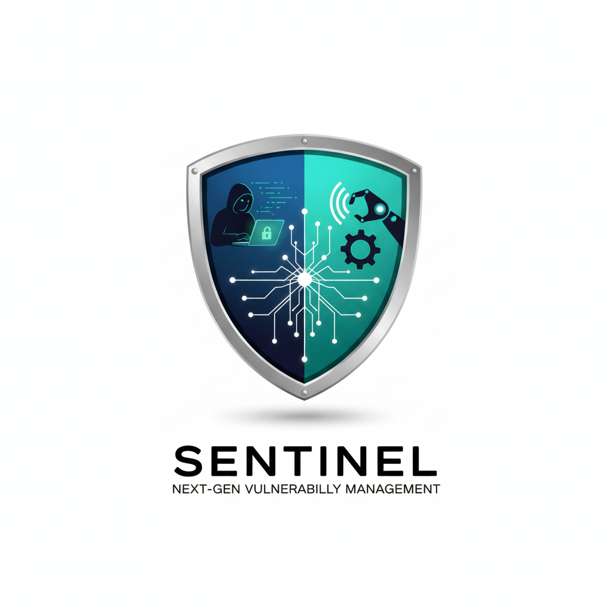

<div align="center">



### Next-Generation Vulnerability Management Platform

[](https://sast.code-x.my/dashboard?id=sentinel)
[](https://sast.code-x.my/dashboard?id=sentinel)
[](https://sast.code-x.my/dashboard?id=sentinel)
[](https://sast.code-x.my/dashboard?id=sentinel)

*Empowering security teams with intelligent vulnerability management, automated workflows, and enterprise-grade reporting*

</div>


## 🎯 **Overview**

**Sentinel** revolutionizes vulnerability management for IT Security Engineers, DevSecOps teams, and Security Management. By centralizing vulnerability findings from **Nessus Pro** and other security tools, Sentinel transforms raw security data into actionable intelligence.

### ✨ **Why Choose Sentinel?**

<table>
  <tr>
    <td align="center"><strong>🔄</strong><br><strong>Smart Deduplication</strong><br>Eliminates duplicate findings across tools</td>
    <td align="center"><strong>📊</strong><br><strong>SLA Tracking</strong><br>Monitor compliance & performance metrics</td>
    <td align="center"><strong>🤖</strong><br><strong>Automation</strong><br>Streamlined workflows & reporting</td>
    <td align="center"><strong>🎯</strong><br><strong>Centralized Dashboards</strong><br>Unified view of security posture</td>
  </tr>
</table>

> 💡 **Impact:** Organizations report 60% faster vulnerability remediation and 40% improved SLA compliance with centralized management.


## 🚀 **Some of Sentinel's Core Capabilities**

<div align="center">

### *Enterprise-Grade Security Solutions Designed for Scale*

</div>

<table>
  <thead>
    <tr>
      <th align="center" width="25%">🎯 <strong>Feature</strong></th>
      <th align="center" width="45%">📋 <strong>Description</strong></th>
      <th align="center" width="30%">🎉 <strong>Key Benefit</strong></th>
    </tr>
  </thead>
   <tbody>
    <tr>
      <td>Custom Tool Support</td>
      <td>Sentinel allows users to create custom plugins to support any tool as needed.</td>
      <td>Acts as a centralized vulnerability management platform for all product types.</td>
    </tr>
    <tr>
      <td>AI Support</td>
      <td>Sentinel integrates with OpenAI-supported schemes, enabling a wide range of AI applications.</td>
      <td>Simplifies and explains vulnerabilities in a way understandable even to non-IT users.</td>
    </tr>
    <tr>
      <td>CI/CD Support</td>
      <td>Built with a “shift-left” philosophy, Sentinel can automatically ingest scan results from CI/CD pipelines.</td>
      <td>Streamlines vulnerability tracking and accelerates remediation actions.</td>
    </tr>
    <tr>
      <td>Deduplicate Finding Removal</td>
      <td>Sentinel intelligently identifies and removes duplicate findings.</td>
      <td>Improves accuracy in vulnerability tracking and reduces noise.</td>
    </tr>
    <tr>
      <td>SLA Tracker</td>
      <td>Tracks pending findings against SLA deadlines.</td>
      <td>Helps security engineers ensure timely remediation and maintain compliance.</td>
    </tr>
    <tr>
      <td>Structured Project Support</td>
      <td>Supports multiple projects and products with structured tracking.</td>
      <td>Enables security teams to monitor assessments and findings across different products.</td>
    </tr>
    <tr>
      <td>Support for VAPT and Compliance (Experimental)</td>
      <td>Extends beyond traditional vulnerability assessment to include compliance checks.</td>
      <td>Provides more comprehensive protection than standard VA-only tools.</td>
    </tr>
  </tbody>
</table>


<div align="center">

### 🏆 **Why Security Teams Choose Sentinel**

<table>
  <tr>
    <td align="center">
      <strong>⚡ Speed</strong><br>
      <sub>75% faster remediation cycles</sub>
    </td>
    <td align="center">
      <strong>🎯 Precision</strong><br>
      <sub>Smart deduplication & prioritization</sub>
    </td>
    <td align="center">
      <strong>🤝 Integration</strong><br>
      <sub>Seamless tool ecosystem support</sub>
    </td>
    <td align="center">
      <strong>📊 Intelligence</strong><br>
      <sub>AI-powered vulnerability insights</sub>
    </td>
  </tr>
</table>

</div>


**Key Benefits:**
- ✅ **Granular tracking** - Host, port, and CVE-level precision
- ✅ **SLA accuracy** - Individual finding lifecycle management
- ✅ **Remediation focus** - Prioritized actionable intelligence


## 👥 **User Ecosystem**

<div align="center">

<table>
  <tr>
    <td align="center">
      <strong>🛠️ Administrator</strong><br>
      <em>Full System Control</em><br>
      • Complete system access<br>
      • User & role management<br>
      • System configuration
    </td>
    <td align="center">
      <strong>🔒 IT Security Engineer</strong><br>
      <em>Security Operations</em><br>
      • Vulnerability assessment<br>
      • User assignment & ownership<br>
      • Scan management
    </td>
  </tr>
  <tr>
    <td align="center">
      <strong>👔 Management/CISO</strong><br>
      <em>Strategic Oversight</em><br>
      • Executive dashboards<br>
      • Compliance reporting<br>
      • Risk analytics
    </td>
    <td align="center">
      <strong>📦 Product Owner</strong><br>
      <em>Product-Focused</em><br>
      • Product-specific findings<br>
      • Scoped access control<br>
      • Remediation tracking
    </td>
  </tr>
</table>

</div>


## 🚀 **Quick Start Guide**

### **Prerequisites**
- Docker & Docker Compose
- Git
- Minimum 4GB RAM, 10GB storage

### **🔥 One-Command Deployment**

```bash
# 1️⃣ Clone repository
git clone <repository_url>
cd sentinel

# 2️⃣ Configure environment
cp .env.docker .env

# 3️⃣ Launch Sentinel
docker-compose up --build -d
```

### **🎯 Access Your Platform**
Navigate to your configured `APP_URL` in `.env` file

```
## Monitor Status
docker-compose logs -f sentinel  

## Health Check
docker-compose ps
```


## 🤝 **Contributing to Sentinel**

<div align="center">

We welcome contributors who share our vision of revolutionizing vulnerability management!

</div>

| 🎯 **Role** | 🚀 **Contribution Areas** | 🏆 **Impact** |
|:|:|:|
| **👩‍💻 Developers** | Feature development, API enhancements, UI/UX improvements | Shape the future of security tooling |
| **🔒 Security Researchers** | CVE testing, vulnerability assessment, security hardening | Strengthen enterprise security |
| **🌐 Community Members** | Documentation, feedback, use case sharing | Grow the security ecosystem |

### **🛠️ Contribution Workflow**

```bash
# Fork & clone
git clone <your-fork-url>
cd sentinel

# Create feature branch
git checkout -b feature/amazing-new-capability

# Develop & test your changes
git add .
git commit -m "feat: add amazing new capability"

# Submit your contribution
git push origin feature/amazing-new-capability
# Open Pull Request via GitHub
```

<div align="center">

**🌟 Recognition:** All contributors are featured in our Hall of Fame!

</div>


## 🌟 **Our Amazing Contributors**

<div align="center">

We're grateful for the incredible individuals driving Sentinel's success:

<table>
  <tr>
    <td align="center">
      <a href="https://www.linkedin.com/in/muzaffarmohamed/?originalSubdomain=my">
        <strong>🎯 Muzaffar Mohamed (Exrienz)</strong>
      </a><br>
      <em>Project Manager & Visionary</em><br>
      Leading product strategy & community growth
    </td>
    <td align="center">
      <a href="https://www.linkedin.com/in/amirul-zafrin">
        <strong>💻 Amirul Zafrin</strong>
      </a><br>
      <em>Lead Developer</em><br>
      Core architecture & feature development
    </td>
  </tr>
</table>

*Want to join this elite group? [Start contributing today!](#-contributing-to-sentinel)*

</div>


## 🏢 **Proudly Sponsored By**

<div align="center">

<a href="#sponsors">
  
</a>

</div>

<br><br>

<div align="center">

<sub>
  <a href="#-quick-start-guide">Get started now</a> | 
  <a href="#-contributing-to-sentinel">Join our community</a> | 
  <a href="issues">Report Issues</a>
</sub>
<br>
<br>
<p><strong>📄 License:</strong> See <a href="LICENSE">LICENSE</a> file for complete terms and conditions</p>

<p>© 2025 Sentinel Project. Built with ❤️ for the global security community.</p>

</div>
