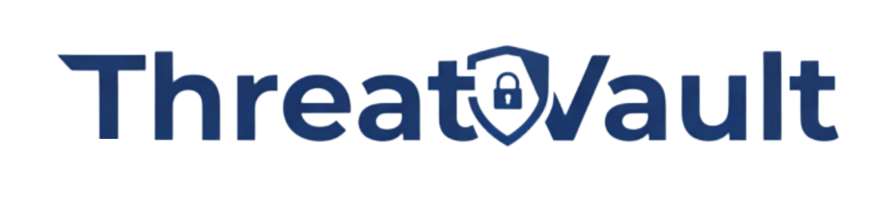

<div align="center">



### Next-Generation Unified Vulnerability and Compliance Management Platform

[](https://sast.code-x.my/dashboard?id=sentinel)
[](https://sast.code-x.my/dashboard?id=sentinel)
[](https://sast.code-x.my/dashboard?id=sentinel)
[](https://sast.code-x.my/dashboard?id=sentinel)
[](https://deepwiki.com/exrienz/Sentinel)

*Created by security engineers for security engineers - transforming raw vulnerability data into actionable intelligence*

**[Website](https://threatvault.io/) | [Documentation](https://docs.threatvault.io/)**

</div>

## 🎯 **Overview**

**ThreatVault** is a next-generation unified vulnerability and compliance management platform designed to centralize and streamline security operations for IT Security Engineers, DevSecOps teams, and Security Management. Built with a FastAPI backend and PostgreSQL database, ThreatVault transforms raw vulnerability data from multiple sources into actionable intelligence through smart deduplication, SLA tracking, and AI-powered explanations.

### ✨ **Why Choose ThreatVault?**

<table>
  <tr>
    <td align="center"><strong>🔄</strong><br><strong>Smart Deduplication</strong><br>Eliminates duplicate findings across tools</td>
    <td align="center"><strong>📊</strong><br><strong>SLA Tracking</strong><br>Monitor compliance & performance metrics</td>
    <td align="center"><strong>🤖</strong><br><strong>AI Integration</strong><br>Better explanations for non-technical teams</td>
    <td align="center"><strong>🎯</strong><br><strong>Unified Dashboards</strong><br>VAPT, Compliance & Management views</td>
  </tr>
</table>

> 💡 **Impact:** Organizations using ThreatVault report 60% faster vulnerability remediation and 40% improved SLA compliance with centralized management.

<br><br>
## 🚀 **Core Capabilities**

<div align="center">

### *Enterprise-Grade Security Solutions Designed for Scale*

</div>

<table>
  <thead>
    <tr>
      <th align="center" width="25%">🎯 <strong>Feature</strong></th>
      <th align="center" width="45%">📋 <strong>Description</strong></th>
      <th align="center" width="30%">🎉 <strong>Key Benefit</strong></th>
    </tr>
  </thead>
   <tbody>
    <tr>
      <td>Multi-Tool Integration</td>
      <td>Support for Nessus, OpenVAS, OWASP ZAP, Trivy, and more through a flexible plugin architecture</td>
      <td>Acts as a centralized platform for all vulnerability data across the DevSecOps lifecycle</td>
    </tr>
    <tr>
      <td>AI-Powered Analysis</td>
      <td>Integration with OpenAI to provide enhanced vulnerability explanations and insights</td>
      <td>Simplifies complex security issues for better understanding by non-technical stakeholders</td>
    </tr>
    <tr>
      <td>DevSecOps Ready</td>
      <td>Built with a "shift-left" philosophy for seamless integration with CI/CD pipelines</td>
      <td>Streamlines vulnerability tracking and accelerates remediation actions</td>
    </tr>
    <tr>
      <td>Smart Deduplication</td>
      <td>Intelligently identifies and removes duplicate findings across multiple tools</td>
      <td>Improves accuracy in vulnerability tracking and reduces noise</td>
    </tr>
    <tr>
      <td>SLA Management</td>
      <td>Tracks pending findings against SLA deadlines based on severity levels</td>
      <td>Ensures timely remediation and maintains compliance standards</td>
    </tr>
    <tr>
      <td>Comprehensive Dashboards</td>
      <td>Dedicated VAPT, Compliance, and Management dashboards with actionable insights</td>
      <td>Provides tailored views for different stakeholders across the organization</td>
    </tr>
    <tr>
      <td>Role-Based Access Control</td>
      <td>Granular access management with five distinct user roles</td>
      <td>Ensures appropriate access levels for different team members and stakeholders</td>
    </tr>
  </tbody>
</table>

<div align="center">

### 🏆 **Why Security Teams Choose ThreatVault**

<table>
  <tr>
    <td align="center">
      <strong>⚡ Speed</strong><br>
      <sub>75% faster remediation cycles</sub>
    </td>
    <td align="center">
      <strong>🎯 Precision</strong><br>
      <sub>Smart deduplication & prioritization</sub>
    </td>
    <td align="center">
      <strong>🤝 Integration</strong><br>
      <sub>Seamless tool ecosystem support</sub>
    </td>
    <td align="center">
      <strong>📊 Intelligence</strong><br>
      <sub>AI-powered vulnerability insights</sub>
    </td>
  </tr>
</table>

</div>

**Key Benefits:**
- ✅ **Granular tracking** - Host, port, and CVE-level precision
- ✅ **SLA accuracy** - Individual finding lifecycle management
- ✅ **Remediation focus** - Prioritized actionable intelligence

<br><br>
## 👥 **User Roles & Access**

<div align="center">

<table>
  <tr>
    <td align="center">
      <strong>🛠️ Administrator</strong><br>
      <em>Full System Control</em><br>
      • Complete system access<br>
      • User & role management<br>
      • System configuration
    </td>
    <td align="center">
      <strong>🔒 IT Security Engineer (ITSE)</strong><br>
      <em>Security Operations</em><br>
      • User access approval<br>
      • Role & project assignment<br>
      • Scan result management
    </td>
  </tr>
  <tr>
    <td align="center">
      <strong>👔 Management</strong><br>
      <em>Strategic Oversight</em><br>
      • Read-only access to all products<br>
      • Executive dashboards<br>
      • Compliance reporting
    </td>
    <td align="center">
      <strong>📦 Product Owner</strong><br>
      <em>Product-Focused</em><br>
      • Access to granted projects<br>
      • Remediation tracking<br>
      • Product-specific findings
    </td>
  </tr>
  <tr>
    <td align="center" colspan="2">
      <strong>🔍 Audit</strong><br>
      <em>Compliance Oversight (Under Development)</em><br>
      • Audit trail access<br>
      • Compliance verification<br>
      • Reporting capabilities
    </td>
  </tr>
</table>

</div>

<br><br>
## 🚀 **Quick Start Guide**

### **Prerequisites**
- Docker & Docker Compose
- Git
- Minimum 4GB RAM, 10GB storage

### **🔥 One-Command Deployment**

```bash
# 1️⃣ Clone repository
git clone <repository_url>
cd threatvault

# 2️⃣ Configure environment
cp .env.docker .env

# 3️⃣ Launch ThreatVault
docker-compose up --build -d
```

### **🎯 Access Your Platform**
Navigate to the APP_URL configured in your .env file

### **📊 Monitoring**

```bash
# View application logs
docker-compose logs -f threatvault

# Check health status
docker-compose ps
```

<br><br>
## 💻 **Technology Stack**

<table>
  <tr>
    <td><strong>Backend</strong></td>
    <td>
      • FastAPI (Python web framework)<br>
      • PostgreSQL 17.0 (database)<br>
      • Alembic (DB migrations/versioning)<br>
      • SQLAlchemy (async ORM)<br>
      • Polars & Pandas (data manipulation)
    </td>
  </tr>
  <tr>
    <td><strong>Frontend</strong></td>
    <td>
      • Server-side HTML templates<br>
      • Bootstrap (styling)<br>
      • HTMX 2.0.4 (dynamic UI, SSE)<br>
      • jQuery (DOM manipulation)<br>
      • DataTables (data tables)<br>
      • ApexCharts (visualizations)<br>
      • SweetAlert2 (alerts)<br>
      • Choices.js (select inputs)
    </td>
  </tr>
  <tr>
    <td><strong>Infrastructure</strong></td>
    <td>
      • Docker (containerization)<br>
      • Docker Compose (orchestration)<br>
      • SessionMiddleware & CORS middleware (API/session management)
    </td>
  </tr>
  <tr>
    <td><strong>Security</strong></td>
    <td>
      • JWT + OAuth2 (authentication)<br>
      • Role-based access control (RBAC)
    </td>
  </tr>
  <tr>
    <td><strong>Integrations</strong></td>
    <td>
      • OpenAI API (AI vulnerability analysis)<br>
      • xhtml2pdf (PDF generation)
    </td>
  </tr>
  <tr>
    <td><strong>Architecture</strong></td>
    <td>
      • Layered separation: presentation, application, domain, persistence<br>
      • Static assets served from /assets endpoint<br>
      • Automatic DB initialization and scheduler on startup<br>
      • Server-Sent Events (SSE) for real-time updates
    </td>
  </tr>
</table>

<br><br>
## 🤝 **Contributing to ThreatVault**

<div align="center">

We welcome contributors who share our vision of revolutionizing vulnerability management!

</div>

| 🎯 **Role**                 | 🚀 **Contribution Areas**                       | 🏆 **Impact**                           |
|:----------------------------|:-----------------------------------------------|:---------------------------------------|
| **👩‍💻 Developers**         | Feature development, API enhancements, UI/UX improvements | Shape the future of security tooling  |
| **🔒 Security Researchers** | CVE testing, vulnerability assessment, security hardening | Strengthen enterprise security        |
| **🌐 Community Members**    | Documentation, feedback, use case sharing     | Grow the security ecosystem           |


### **🛠️ Contribution Workflow**

```bash
# Fork & clone
git clone <your-fork-url>
cd threatvault

# Create feature branch
git checkout -b feature/amazing-new-capability

# Develop & test your changes
git add .
git commit -m "feat: add amazing new capability"

# Submit your contribution
git push origin feature/amazing-new-capability
# Open Pull Request via GitHub
```

<div align="center">

**🌟 Recognition:** All contributors are featured in our Hall of Fame!

</div>

<br><br>
## 🌟 **Our Amazing Contributors**

<div align="center">

We're grateful for the incredible individuals driving ThreatVault's success:

<table>
  <tr>
    <td align="center">
      <a href="https://www.linkedin.com/in/muzaffarmohamed/?originalSubdomain=my">
        <strong>🎯 Muzaffar Mohamed (Exrienz)</strong>
      </a><br>
      <em>Project Manager & Visionary</em><br>
      Leading product strategy & community growth
    </td>
    <td align="center">
      <a href="https://www.linkedin.com/in/amirul-zafrin">
        <strong>💻 Amirul Zafrin</strong>
      </a><br>
      <em>Lead Developer</em><br>
      Core architecture & feature development
    </td>
  </tr>
</table>

*Want to join this elite group? [Start contributing today!](#-contributing-to-threatvault)*

</div>

<br><br>
## 🏢 **Proudly Sponsored By**

<div align="center">

<a href="#sponsors">
  
</a>

</div>


<div align="center">

<sub>
  <a href="#-quick-start-guide">Get started now</a> | 
  <a href="#-contributing-to-threatvault">Join our community</a> | 
  <a href="issues">Report Issues</a>
</sub>
<br>
<br>
<p><strong>📄 License:</strong> See <a href="LICENSE">LICENSE</a> file for complete terms and conditions</p>

<p>© 2025 ThreatVault Project. Built with ❤️ for the global security community.</p>

<p><strong>⚠️ Disclaimer:</strong> This project is not affiliated with, endorsed by, or related in any way to Palo Alto Networks' ThreatVault. ThreatVault as presented here is an independent open-source project with no connection to any commercial product or service with a similar name.</p>

</div>
