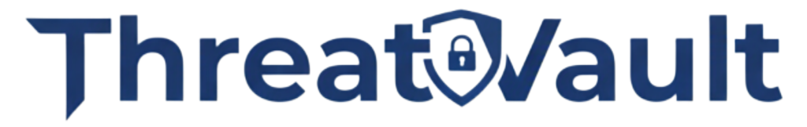

<div align="center">



### Next-Generation Vulnerability Management Platform

[](https://sast.code-x.my/dashboard?id=sentinel)
[](https://sast.code-x.my/dashboard?id=sentinel)
[](https://sast.code-x.my/dashboard?id=sentinel)
[](https://sast.code-x.my/dashboard?id=sentinel)

*Empowering security teams with intelligent vulnerability management, automated workflows, and enterprise-grade reporting*

</div>

---

## 🎯 **Overview**

**Sentinel** revolutionizes vulnerability management for IT Security Engineers, DevSecOps teams, and Security Management. By centralizing vulnerability findings from **Nessus Pro** and other security tools, Sentinel transforms raw security data into actionable intelligence.

### ✨ **Why Choose Sentinel?**

<table>
  <tr>
    <td align="center"><strong>🔄</strong><br><strong>Smart Deduplication</strong><br>Eliminates duplicate findings across tools</td>
    <td align="center"><strong>📊</strong><br><strong>SLA Tracking</strong><br>Monitor compliance & performance metrics</td>
    <td align="center"><strong>🤖</strong><br><strong>Automation</strong><br>Streamlined workflows & reporting</td>
    <td align="center"><strong>🎯</strong><br><strong>Centralized Dashboards</strong><br>Unified view of security posture</td>
  </tr>
</table>

> 💡 **Impact:** Organizations report 60% faster vulnerability remediation and 40% improved SLA compliance with centralized management.

---

## 🚀 **Core Capabilities**

<div align="center">

| 🎯 **Feature** | 📋 **Description** | 🎉 **Benefit** |
|:---|:---|:---|
| **🔗 Nessus Pro Integration** | Full CVE & host mapping with real-time sync | Comprehensive vulnerability visibility |
| **🤖 Intelligent Automation** | Smart closure & workflow orchestration | 75% reduction in manual tasks |
| **⚡ Performance Analytics** | Advanced metrics & trend analysis | Data-driven security decisions |
| **🛡️ Enterprise Support** | Dedicated PayNet professional services | Mission-critical reliability |
| **📈 SLA Management** | Automated tracking & compliance reporting | Regulatory compliance made easy |
| **👥 Role-Based Access** | Granular permissions & user management | Secure collaborative workflows |

</div>

---

**Key Benefits:**
- ✅ **Granular tracking** - Host, port, and CVE-level precision
- ✅ **SLA accuracy** - Individual finding lifecycle management
- ✅ **Remediation focus** - Prioritized actionable intelligence

---

## 👥 **User Ecosystem**

<div align="center">

<table>
  <tr>
    <td align="center">
      <strong>🛠️ Administrator</strong><br>
      <em>Full System Control</em><br>
      • Complete system access<br>
      • User & role management<br>
      • System configuration
    </td>
    <td align="center">
      <strong>🔒 IT Security Engineer</strong><br>
      <em>Security Operations</em><br>
      • Vulnerability assessment<br>
      • User assignment & ownership<br>
      • Scan management
    </td>
  </tr>
  <tr>
    <td align="center">
      <strong>👔 Management/CISO</strong><br>
      <em>Strategic Oversight</em><br>
      • Executive dashboards<br>
      • Compliance reporting<br>
      • Risk analytics
    </td>
    <td align="center">
      <strong>📦 Product Owner</strong><br>
      <em>Product-Focused</em><br>
      • Product-specific findings<br>
      • Scoped access control<br>
      • Remediation tracking
    </td>
  </tr>
</table>

</div>

---

## 🚀 **Quick Start Guide**

### **Prerequisites**
- Docker & Docker Compose
- Git
- Minimum 4GB RAM, 10GB storage

### **🔥 One-Command Deployment**

```bash
# 1️⃣ Clone repository
git clone <repository_url>
cd sentinel

# 2️⃣ Configure environment
cp .env.docker .env

# 3️⃣ Launch Sentinel
docker-compose up --build -d
```

### **🎯 Access Your Platform**
Navigate to your configured `APP_URL` in `.env` file

```
## Monitor Status
docker-compose logs -f sentinel  

## Health Check
docker-compose ps
```

---

## 🤝 **Contributing to Sentinel**

<div align="center">

We welcome contributors who share our vision of revolutionizing vulnerability management!

</div>

| 🎯 **Role** | 🚀 **Contribution Areas** | 🏆 **Impact** |
|:---|:---|:---|
| **👩‍💻 Developers** | Feature development, API enhancements, UI/UX improvements | Shape the future of security tooling |
| **🔒 Security Researchers** | CVE testing, vulnerability assessment, security hardening | Strengthen enterprise security |
| **🌐 Community Members** | Documentation, feedback, use case sharing | Grow the security ecosystem |

### **🛠️ Contribution Workflow**

```bash
# Fork & clone
git clone <your-fork-url>
cd sentinel

# Create feature branch
git checkout -b feature/amazing-new-capability

# Develop & test your changes
git add .
git commit -m "feat: add amazing new capability"

# Submit your contribution
git push origin feature/amazing-new-capability
# Open Pull Request via GitHub
```

<div align="center">

**🌟 Recognition:** All contributors are featured in our Hall of Fame!

</div>

---

## 🌟 **Our Amazing Contributors**

<div align="center">

We're grateful for the incredible individuals driving Sentinel's success:

<table>
  <tr>
    <td align="center">
      <a href="https://www.linkedin.com/in/muzaffarmohamed/?originalSubdomain=my">
        <strong>🎯 Muzaffar Mohamed (Exrienz)</strong>
      </a><br>
      <em>Project Manager & Visionary</em><br>
      Leading product strategy & community growth
    </td>
    <td align="center">
      <a href="https://www.linkedin.com/in/amirul-zafrin">
        <strong>💻 Amirul Zafrin</strong>
      </a><br>
      <em>Lead Developer</em><br>
      Core architecture & feature development
    </td>
  </tr>
</table>

*Want to join this elite group? [Start contributing today!](#-contributing-to-sentinel)*

</div>

---

## 🏢 **Enterprise Partnership**

<div align="center">

### **Proudly Sponsored By**

<a href="#sponsors">
  
</a>

</div>

---

## 📜 **Legal & Licensing**

<div align="center">

**📄 License:** See [LICENSE](LICENSE) file for complete terms and conditions

*© 2024 Sentinel Project. Built with ❤️ for the global security community.*

---

<sub>**🚀 Ready to transform your vulnerability management?** [Get started now](#-quick-start-guide) | **💬 Questions?** [Join our community](#-contributing-to-sentinel) | **🐛 Found an issue?** [Report it here](issues)</sub>

</div>
